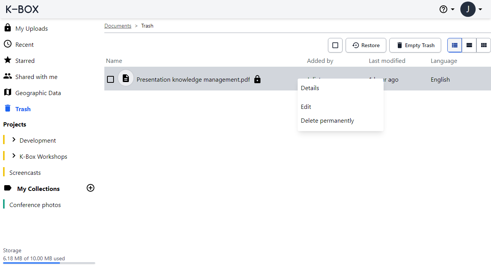

# Trash

The trash contains every document and collection you delete. It gives you a second chance to not loose your documents.

The picture above shows an example of the trash content.

When you trash a collection also the sub-collections are trashed.

> The administrator trash shows everything that has been trashed, so pay close attention

## Permanently delete a document or a collection

You can permanently delete a single document or a collection by using the mouse right click menu (also called context menu). There you can find the action _Permanently Delete_, like in the picture above.

The current release cannot permanently delete a selection of collections and documents at the same time.

Trashed collections can only be permanently deleted by its creator, or the project manager if they were in a project.

## Empty the trash

To permanently delete all the documents and collections in the trash you can use the _Empty Trash_ button. Pressing that button will permanently remove all the trash content.

## Trash behavior

Trash behavior is governed by user user roles and permissions assigned to them.

### "Partner" account trashing capabilities

| File location | File uploader | Can delete? | Can see in Trash? | Can delete permanently? |
|---------------|---------------|-------------|-------------------|-------------------------|
| In "My Uploads" | Partner | Yes | Yes | No |
| In "My Collections" | Partner | Yes | Yes | No |
| In "My Collections" | Another user | Yes | No | No |
| Shared with another user | Partner | Yes | Yes | No |
| In "Shared with me" | Another user | Yes | No | No |
| In "Projects" | Partner | Yes | Yes | No |
| In "Projects" | Another user | Yes | No | No |

### "Project Manager" (PM) account trashing capabilities

| File location | File uploader | Can delete? | Can see in Trash? | Can delete permanently? |
|---------------|---------------|-------------|-------------------|-------------------------|
| In "My Uploads" | PM | Yes | Yes | Yes |
| In "My Collections" | PM | Yes | Yes | Yes |
| In "My Collections" | Another user | Yes | No | No |
| Shared with another user | PM | Yes | Yes | Yes |
| In "Shared with me" | Another user | Yes | No | No |
| In "Projects" | PM | Yes | Yes | Yes |
| In "Projects" | Another user | Yes | No | No |

### "K-Box Administrator" (Admin) account trashing capabilities

| File location | File uploader | Can delete? | Can see in Trash? | Can delete permanently? |
|---------------|---------------|-------------|-------------------|-------------------------|
| In "My Uploads" | Admin | Yes | Yes | Yes |
| In "My Collections" | Admin | Yes | Yes | Yes |
| In "My Collections" | Another user | Yes | Yes | Yes |
| Shared with another user | Admin | Yes | Yes | Yes |
| In "Shared with me" | Another user | Yes | Yes | Yes |
| In "Projects" | Admin | Yes | Yes | Yes |
| In "Projects" | Another user | Yes | Yes | Yes |

### Collections trashing

Collection created in "My Collections" section can be trashed and deleted permanently by its creator.

Collection created in "Projects" section can be trashed by its creator, but only Project Manager or K-Box Administrator can delete it permanently.

